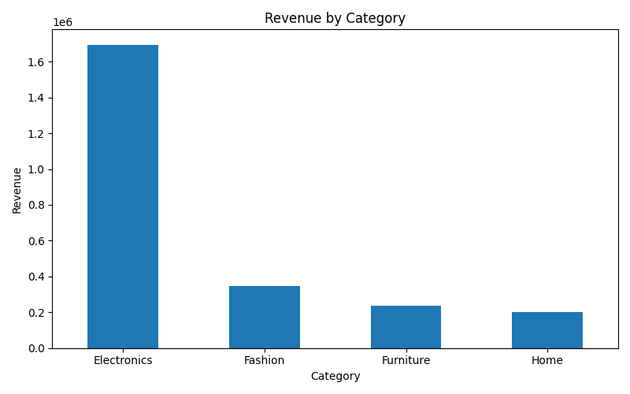
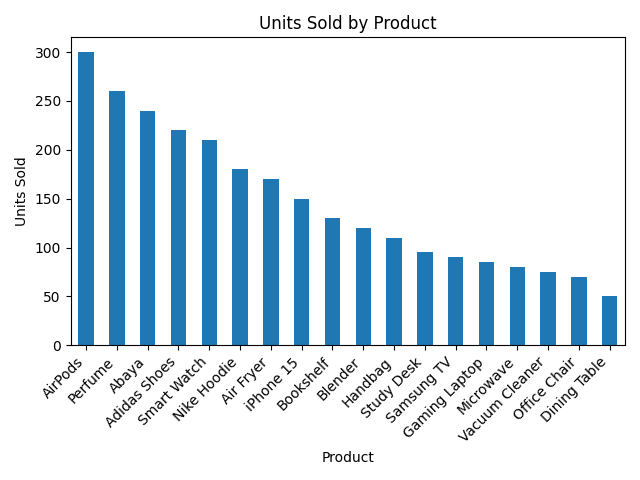
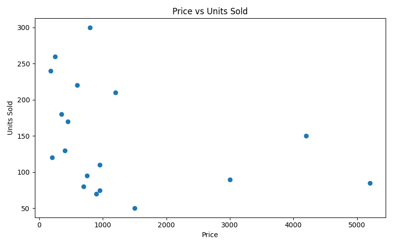
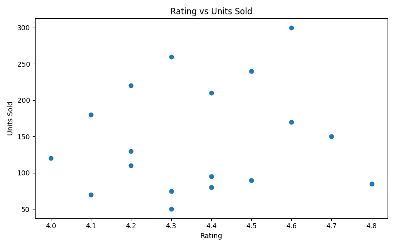
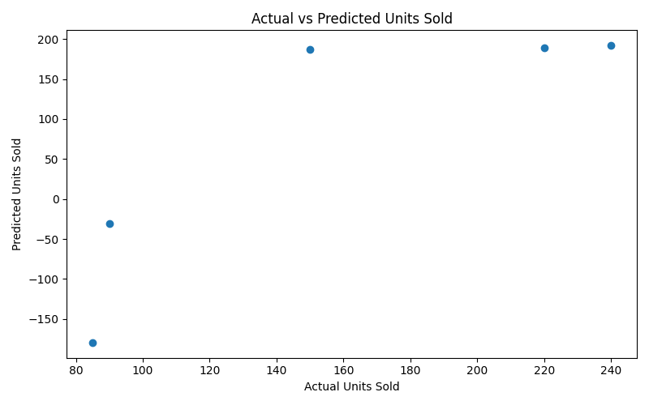

# E-commerce Sales Analysis & Prediction

This project analyzes e-commerce product data to uncover category trends, pricing patterns, product performance, and sales behavior. It also builds a regression model to estimate units sold using product features.

## Features
- Data cleaning and preprocessing  
- Category and product performance analysis  
- Sales trend visualization  
- Correlation and pricing analysis  
- Sales prediction using regression  

## Tools Used
- Python
- Pandas
- Matplotlib
- Scikit-learn

## Files Included
- `ecommerce_analysis.py`
- `ecommerce.csv`
- `category_summary.csv`
- `top_revenue_products.csv`
- `correlation_matrix.csv`
- `prediction_results.csv`
- `revenue_by_category.png`
- `units_sold_by_product.png`
- `price_vs_units_sold.png`
- `rating_vs_units_sold.png`
- `actual_vs_predicted.png`

## Results
- Identified Electronics as the highest revenue category
- Found strong relationship between price and units sold
- Highlighted top-performing products by revenue and volume
- Built a regression model to estimate future sales

## Key Insights
- Electronics generated the highest overall revenue
- Fashion products achieved strong sales volume at lower prices
- Discount and rating influenced performance differently across categories
- Value score highlighted products with strong customer value relative to price

## Visualizations

### Revenue by Category
This chart shows total revenue generated by each product category.

### Units Sold by Product
This chart highlights product-level sales volume across the dataset.

### Price vs Units Sold
This scatter plot explores the relationship between product price and units sold.

### Rating vs Units Sold
This visualization shows how customer ratings relate to sales performance.

### Actual vs Predicted Units Sold
This chart compares actual sales values with the regression model’s predictions.

